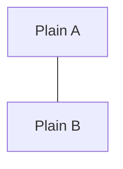

# Mermaid Image Node Probe

This file checks whether GitHub can render Mermaid v11.3+ image nodes.

## GitHub Mermaid Version

```mermaid
info
```

## Image Node

```mermaid
flowchart TD
  A@{ img: "https://github.githubassets.com/images/modules/logos_page/GitHub-Mark.png", label: "GitHub image node", pos: "b", w: 60, h: 60, constraint: "on" }
  B["Plain node"]
  A --- B
```

## Plain Control


