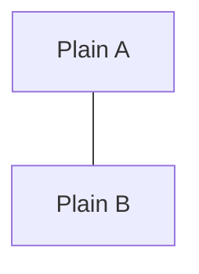

# Mermaid Image Source Probe

Each diagram uses one image node with a different image source.

## GitHub favicon PNG

```mermaid
flowchart TD
  A@{ img: "https://github.githubassets.com/favicons/favicon.png", label: "github favicon", pos: "b", w: 32, h: 32, constraint: "on" }
  B["Plain node"]
  A --- B
```

## Raw GitHub PNG

```mermaid
flowchart TD
  A@{ img: "https://raw.githubusercontent.com/github/explore/main/topics/github/github.png", label: "raw github png", pos: "b", w: 60, h: 60, constraint: "on" }
  B["Plain node"]
  A --- B
```

## Placeholder PNG

```mermaid
flowchart TD
  A@{ img: "https://placehold.co/60x60.png", label: "placeholder png", pos: "b", w: 60, h: 60, constraint: "on" }
  B["Plain node"]
  A --- B
```

## SVG Image

```mermaid
flowchart TD
  A@{ img: "https://api.iconify.design/mdi/person.svg", label: "svg icon", pos: "b", w: 60, h: 60, constraint: "on" }
  B["Plain node"]
  A --- B
```

## Plain Control


